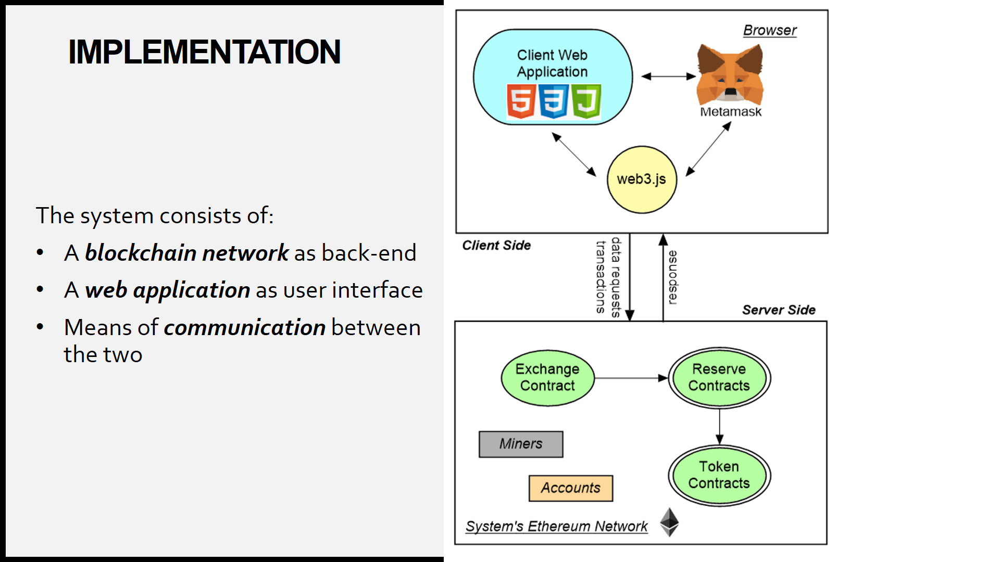

# Decentralized Exchange
Final Project for the Blockchain narrow major at FPT University.
An exchange for ERC-20 tokens with web-based UI.

# About
A decentralized exchange that:
- Connects tokens on the network
- Supports exchanging and transfering tokens
- Provides methods to import and display wallets

More details in [slides](Slides.pptx).

# Implementation

